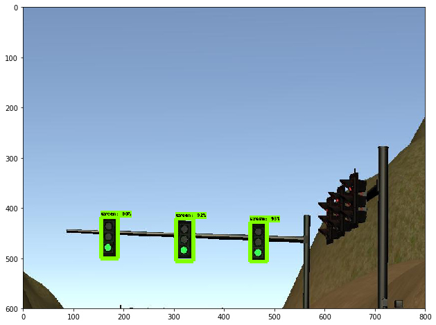
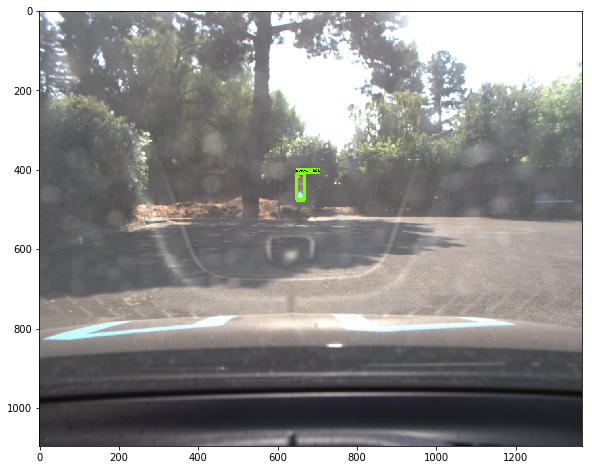

# Self driving car system integration project
## Implemented by Team Hercules (final_project)

#### Dec <31/12/2017>

# Objective

The objective of the project is to control CARLAs throttle, steering and brakes to navigate map waypoints to successfully drive the car on a highway. The car is expected to follow lanes, traffic lights and objects and plan a trajectory to follow based on the waypoints. The car should be able to classify “Red”, “Green”, and “Yellow” lights and be able to stop/start/slow down based on the traffic signal.
Before running our code on CARLA we are developing the code to work in a simulator. 
The simulator works in a very similar way to CARLA as all ROS nodes and topics are same. So if our system works in the simulator, we expect that it should also work on CARLA. 


# Team

•	Ignacio Sañudo	    ignacio.sanudoolmedo@unimore.it	

•	Suren Arustamyan	arustamyansv@gmail.com	

•	Arunava Saha	    aru.saha@gmail.com

•	Pedro Morales	    part.morales@gmail.com	

•	Yadong Liu	      ydliu@yahoo.com			


# Specifications

• Smoothly follow waypoints in the simulator. ✓

• Respect the target top speed set for the waypoints' twist.twist.linear.x in waypoint_loader.py. Be sure to check that this is working by testing with different values for kph velocity parameter in /ros/src/waypoint_loader/launch/waypoint_loader.launch. If your vehicle adheres to the kph target top speed set here, then you have satisfied this requirement. ✓

• Stop at traffic lights when needed. ✓

• Stop and restart PID controllers depending on the state of /vehicle/dbw_enabled. ✓

• Publish throttle, steering, and brake commands at 50hz. ✓

• Launch correctly using the launch files provided in the capstone repo. Please note that we will not be able to accomodate special launch instructions or run additional scripts from your submission to download files. The launch/styx.launch and launch/site.launch files will be used to test code in the simulator and on the vehicle respectively. The submission size limit for this project has been increased to 2GB. ✓


# The system architecture and principles behind it

The system architecture consists of the following modules:

## Perception

Traffic light detection - We used a deep neural net to detect if the upcoming traffic light is red or not. The classifier was built using a **transfer learning** apprach. A detailed description of the architecture and training parameters can be found in the respective section below (under additional resources implemented) 

## Planning
The waypoint updater node publishes a list of n waypoints ahead of the vehicle position, each with a target velocity. For the simulator, n=50 is sufficient.  We refresh all n waypoints by making a copy from the base waypoint list in order to update each waypoint's speed. When a light-state changes, the target speed of waypoints are updated to gradually slow down the vehicle such that it stops at the traffic light waypoint. This module is performed using the ROS Package Waypoint updater which is explained as below:

• Waypoint Updater - sets target velocity for each waypoint based on upcoming traffic lights.  This node subscribed to the nodes /base_waypoints, /current_pose, /obstacle_waypoint, and /traffic_waypoint topics, and published a list of waypoints ahead of the car with target velocities to the /final_waypoints topic.

## Control subsystems

The goal for this part of the project is to implement the drive-by-wire node.
The control subsystem is implemented using the ROS Package drive-by-wire which adjusts throttle and brakes according to the velocity targets published by the waypoint follower (which is informed by the waypoint updater node). If the list of waypoints contains a series of descending velocity targets, the PID velocity controller (in the twist controller component of DBW) will attempt to match the target velocity. The PID velocity controller is implemented using the following parameters: (1,0.003,0.25). 
In this context, the DBW (Drive by Wire) - takes target trajectory information as input and sends control commands to navigate the vehicle.  The dbw_node subscribes to the /current_velocity topic along with the /twist_cmd topic to receive target linear and angular velocities. Additionally, this node subscribes to /vehicle/dbw_enabled, which indicates if the car is under dbw or driver control. This node will publish throttle, brake, and steering commands to the /vehicle/throttle_cmd, /vehicle/brake_cmd, and /vehicle/steering_cmd topics.


## Implementation Nodes

The diagram below illustrates the system architecture. The autonomous vehicle controller is composed of three major units: perception, planning, and control.


  
  a: /camera/image_raw
  b: /current_pose
  c: /current_velocity
  d: /vehicle/dbw_enabled
  e: /traffic_waypoint
  f: /base_waypoints
  g: /final_waypoints
  h: /twist_cmd
  i: /vehicle/throttle_cmd
  j: /vehicle/brake_cmd
  k: /vehicle/steering_cmd

# Operation

There are three modes in which the controller operates:

•	site: When at the test site, this mode is launched. This mode can be run simultaneously with a rosbag to test the traffic light     classifier

•	sitesim: emulates the test site in the simulator at the first traffic light

•	styx: When using the term3 simulator, this mode is launched. The simulator communicates through server.py and bridge.py
These modes are started by roslaunch. For example, to run the styx (simulator) version we run:
roslaunch launch/styx.launch

# Additional Resources Implemented

## Traffic Light Detection

The perception subsystem dynamically detects traffic lights in the proximity of the vehicle and classifies its color. 

In the simulator and test site environment, the car can face either a single traffic light or a set of three traffic lights in the same state. In this exercise, the traffic light state space is restricted to {Green, Red, Yellow}.

The detector was built relying on a **transfer learning** approach: a pre-trained model on a different *broader* object detection task was fine-tuned to perform the specific task of detecting and classifying traffic lights. This decission is backed by the fact that the amount of training data is limited (the Udacity simulator and test track are enclosed environments, providing repetitive scenarios) hence overfitting is a potential issue. Using a pre-trained model allows to economize on the effort of training a feature extractor while avoiding overfitting in problems where data availability is an issue.  

For this project two separate models are trained, one to be used with the simulator, and another one to be used with Carla, in the *real* test environment.

The selected model architecture was a [Faster-RCNN](https://arxiv.org/abs/1506.01497), since it provides high speed inference (~100 ms region) and has superior perfomance on small objects (compared to SSD for instance).

The pre-trained model was taken from TensorFlow's [model zoo](https://github.com/tensorflow/models/blob/master/research/object_detection/g3doc/detection_model_zoo.md). In particular, `faster_rcnn_resnet101coco` was used, which contains the weights of a Faster R-CNN with Resnet-101 architecture trained on the [COCO dataset](http://cocodataset.org/#home).

The pre-trained model was fine-tuned using TensorFlow's [Object Detection API](https://github.com/tensorflow/models/tree/master/research/object_detection) with labeled snapshots from Udacity's simulator, and rosbag data collected at the test site respectively, yielding the two models as explained at the beginning of the section.




# Waypoint Updater

## Implementation

The waypoint updater node publishes a list of n waypoints ahead of the vehicle current position, each with a target velocity. We settled on n=50 after a few trial and error.  The updater refreshes all n waypoints by making a copy from the base waypoints in order to update each waypoint's speed. When a traffic light changes its state (in particular to red), the target speed of waypoints are updated to gradually slow down the vehicle so that it stops at the traffic light waypoint. Here are a few more details on the implementation.

* The list of waypoints are only created and published to the /final_waypoints topic only after the base waypoints and current vehicle position are available.
* Initialize the vehicle's position in the base waypoint list by performing a global search based on distance from the currently reported vehicle coordinates. Find the next waypoint index (`next_index`) that is in front of the vehicle.
* Deep copy n candidate waypoints starting with `next_index` from the base waypoint list
* Keep the target speed of the candidate waypoints unless we are notified of a traffic light ahead identified by a non-negative waypoint index.
* If a red traffic light is detected (as reported by the `tl_dectetor` node above), the candidate waypoints' target speed is reduced to zero at the stop position (after taking into consideration of vehicle length and stop margin)
* The candidate waypoints are published at an interval of 5Hz so that other ROS topic can make use of the data (specifically the `twist_controller` node will use its PID controller to control vehicle speed and lane following)

# Drive By Wire

## Velocity Targets (Stepped)

The drive-by-wire node adjusts throttle and brakes according to the velocity targets published by the waypoint follower (which is informed by the waypoint updater node). If the list of waypoints contains a series of descending velocity targets, the PID velocity controller (in the twist controller component of DBW) will attempt to match the target velocity. 


# The original readme from Udacity

This is the project repo for the final project of the Udacity Self-Driving Car Nanodegree: Programming a Real Self-Driving Car. For more information about the project, see the project introduction [here](https://classroom.udacity.com/nanodegrees/nd013/parts/6047fe34-d93c-4f50-8336-b70ef10cb4b2/modules/e1a23b06-329a-4684-a717-ad476f0d8dff/lessons/462c933d-9f24-42d3-8bdc-a08a5fc866e4/concepts/5ab4b122-83e6-436d-850f-9f4d26627fd9).


### Native Installation

* Be sure that your workstation is running Ubuntu 16.04 Xenial Xerus or Ubuntu 14.04 Trusty Tahir. [Ubuntu downloads can be found here](https://www.ubuntu.com/download/desktop).
* If using a Virtual Machine to install Ubuntu, use the following configuration as minimum:
  * 2 CPU
  * 2 GB system memory
  * 25 GB of free hard drive space

  The Udacity provided virtual machine has ROS and Dataspeed DBW already installed, so you can skip the next two steps if you are using this.

* Follow these instructions to install ROS
  * [ROS Kinetic](http://wiki.ros.org/kinetic/Installation/Ubuntu) if you have Ubuntu 16.04.
  * [ROS Indigo](http://wiki.ros.org/indigo/Installation/Ubuntu) if you have Ubuntu 14.04.
* [Dataspeed DBW](https://bitbucket.org/DataspeedInc/dbw_mkz_ros)
  * Use this option to install the SDK on a workstation that already has ROS installed: [One Line SDK Install (binary)](https://bitbucket.org/DataspeedInc/dbw_mkz_ros/src/81e63fcc335d7b64139d7482017d6a97b405e250/ROS_SETUP.md?fileviewer=file-view-default)
* Download the [Udacity Simulator](https://github.com/udacity/CarND-Capstone/releases).

### Docker Installation
[Install Docker](https://docs.docker.com/engine/installation/)

Build the docker container
```bash
docker build . -t capstone
```

Run the docker file
```bash
docker run -p 4567:4567 -v $PWD:/capstone -v /tmp/log:/root/.ros/ --rm -it capstone
```

### Usage

1. Clone the project repository
```bash
git clone https://github.com/udacity/CarND-Capstone.git
```

2. Install python dependencies
```bash
cd CarND-Capstone
pip install -r requirements.txt
```
3. Make and run styx
```bash
cd ros
catkin_make
source devel/setup.sh
roslaunch launch/styx.launch
```
4. Run the simulator

### Real world testing
1. Download [training bag](https://drive.google.com/file/d/0B2_h37bMVw3iYkdJTlRSUlJIamM/view?usp=sharing) that was recorded on the Udacity self-driving car (a bag demonstraing the correct predictions in autonomous mode can be found [here](https://drive.google.com/open?id=0B2_h37bMVw3iT0ZEdlF4N01QbHc))
2. Unzip the file
```bash
unzip traffic_light_bag_files.zip
```
3. Play the bag file
```bash
rosbag play -l traffic_light_bag_files/loop_with_traffic_light.bag
```
4. Launch your project in site mode
```bash
cd CarND-Capstone/ros
roslaunch launch/site.launch
```
5. Confirm that traffic light detection works on real life images
